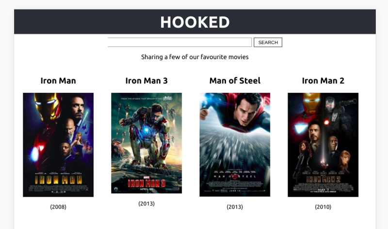

# React Hooks Movie Search App

This movie search example project makes use of React components, hooks, an external api and some styling via CSS

## Tech Stack & Features

* React with Hooks
* **create-react-app**, tool for setting up a React app without having to deal with all the configurations that come with starting from scratch.
* JSX
* CSS

Using no classes this projects gives you an entry point into functional react.

### How to run

From the root folder `reactHooksMovieSearchApp`, execute `npm start`

Below is an image of how the final app looks like:

